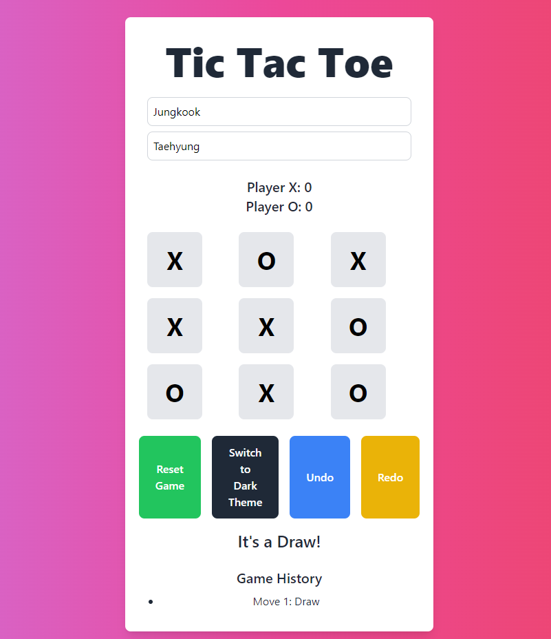

---

# Tic Tac Toe Game



## 🕹️ **Project Overview**

This is a simple **Tic Tac Toe** game built with HTML, Tailwind CSS, and JavaScript. It allows two players to compete, with features like score tracking, turn indicators, undo/redo functionality, and a dark mode theme toggle.

## 🚀 **Live Demo**

Check out the live version of the game hosted on GitHub Pages:
[**Live Tic Tac Toe**](https://limitlessprogrammer.github.io/Tic-Tac-Toe-Game/)

## 📋 **Features**

- **Player vs. Player** mode (Two players)
- **Scoreboard** to track wins
- **Undo/Redo** functionality
- **Dark Mode** toggle
- **Responsive Design** using Tailwind CSS
- **Turn Indicator** to display the active player
- **Game History** to view the sequence of moves

## 🛠️ **Technologies Used**

- **HTML** - for structuring the web page
- **Tailwind CSS** - for responsive and elegant styling
- **JavaScript** - for handling the game logic, interactivity, and DOM manipulation

## 📁 **Project Structure**

```bash
tic-tac-toe/
│
├── public/
│   ├── styles.css         # Tailwind CSS file
│
├── index.html             # Main HTML file
├── script.js              # JavaScript game logic
├── README.md              # Project documentation (this file)
└── .gitignore             # Files to ignore in GitHub
```

## 🎮 **How to Play**

1. **Player 1** (X) starts the game.
2. Players take turns clicking on the grid to place their marks.
3. The first player to align three marks horizontally, vertically, or diagonally wins.
4. **Reset** the game anytime using the reset button.
5. Switch between **dark mode** and **light mode** using the theme toggle button.

## 📦 **How to Run Locally**

To run the game on your local machine:

1. Clone the repository:
   ```bash
   git clone https://github.com/your-username/tic-tac-toe-game.git
   ```
2. Navigate to the project directory:
   ```bash
   cd tic-tac-toe-game
   ```
3. Open `index.html` in your web browser.

## 💻 **How to Deploy on GitHub Pages**

1. Push the code to a GitHub repository.
2. Go to your repository’s **Settings** > **Pages**.
3. Under **Source**, select the `main` branch and the root directory.
4. Save, and GitHub will deploy your game.

## 🎨 **Customization**

Feel free to modify the design, enhance the game logic, or add new features. Contributions are always welcome!


---

Enjoy the game! 🎉
